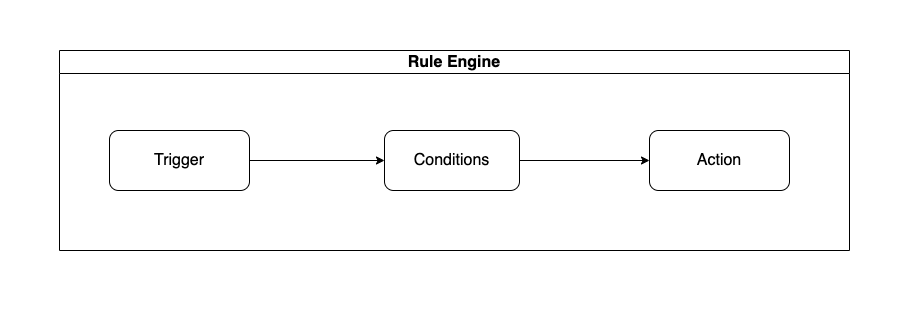
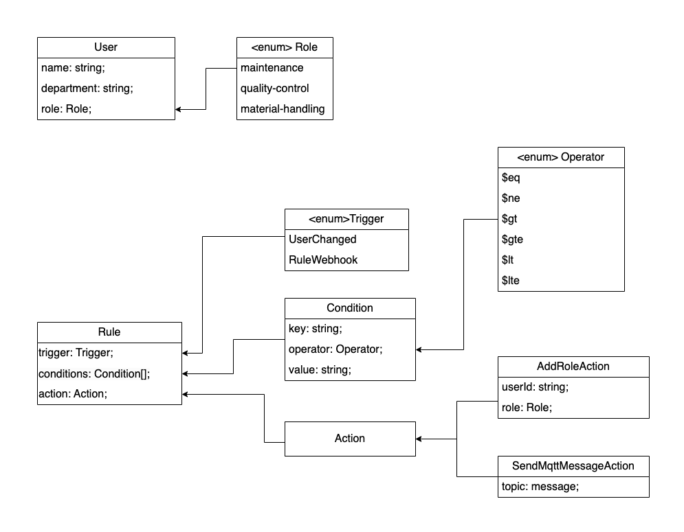
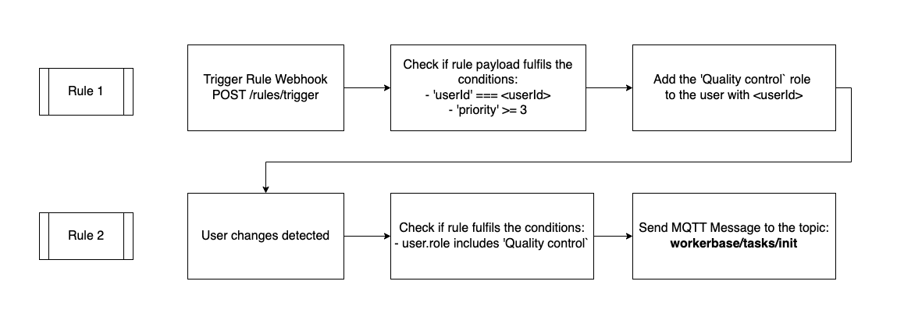

# WORKERBASE Backend challenge

Welcome to the **WORKER**BASE live-coding challenge. This is a challenge in which you need to implement two simple endpoints and a module we call "Rule Engine". It is a module that executes certain actions by being triggered by certain events with certain conditions:



## Prerequisites

In order to complete the task you will need the following:

- code editor of your choice
- NodeJs installed on your machine
- Postman installed on your machine

## The challenge

The tasks of the challenge are:

- create a Rule model
- to implement API endpoint for Rule creation
- to implement an endpoint for the Rule webhook
- to implement the RuleEngine service
- to set up the test case (see Test Case chapter)

### Data structure

The data structure you'll be working with is the following:


Please note that the `User` model is already implemented and the `RuleCondition` interface may be also found in `src/interfaces/RuleCondition.ts`

### Requirements

- using **Typescript** is a must

## Quick start

We prepared the starter project for you that contains a database connection, CRUD endpoints for a User, and Mqtt service.

### How to run:

- copy `.env.development` file into `.env`
- run `npm install` to install the dependencies
- run `npm start` to build and start the project
- run `npm run watch` to start and watch "src" folder

## Success

After completing the task, you should be able to create the following test case:



- create a user via API and get and user's id (See payload in Payload section)
- create a "Rule 1" via API
- create a "Rule 2" via API
- trigger "Rule 1" by requesting Rule Webhook API (See payload in Payload section)

**Expected result**: the message is sent to `workerbase/tasks/init` (See payload in Payload section)

### Payloads

1. Create a User:

```
const UserCreatePaylaod = {
	name: <user's name>,
	email: <user's email>,
	roles: [Roles.MAINTENANCE],
}
```

2. Trigger a rule webhook:

```
const RuleWebhookPayload = {
	userId: <userId>,
	priority: 4
}
```

3. Send task init message via MQTT:

```
const MqttTaskInitPayload = {
	title: "Title",
	headline: "Headline",
	description: "Description",
}
```

Good luck 🤞
